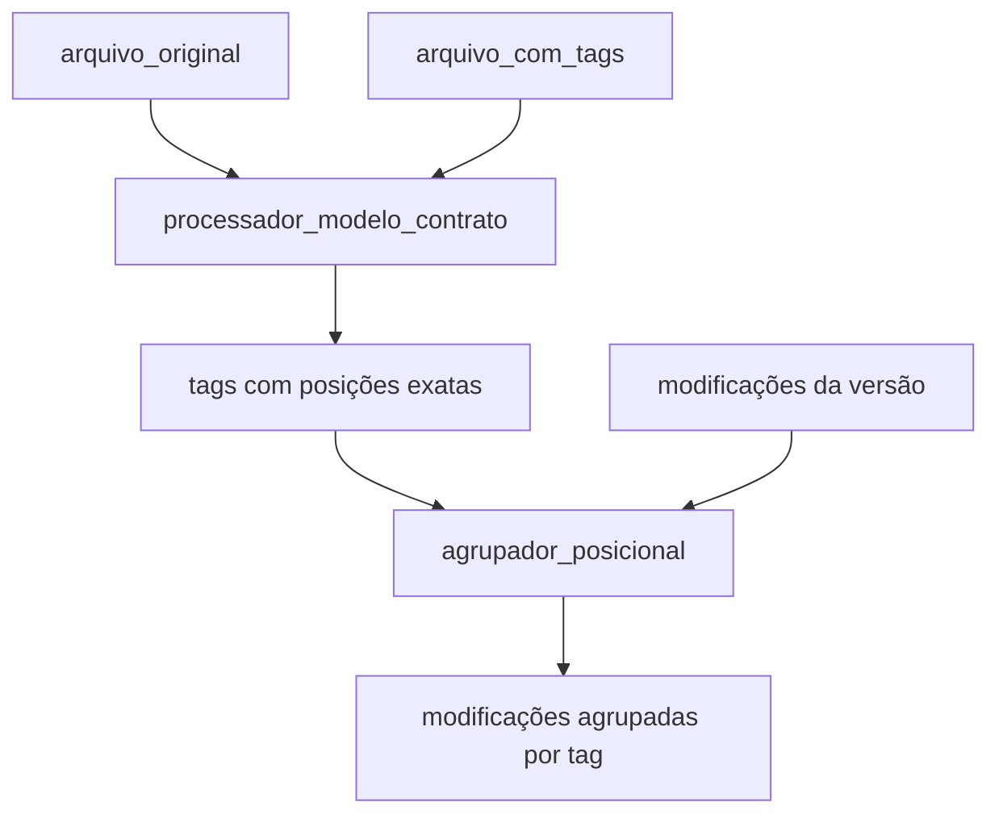

# TASK-001: Agrupamento Posicional de Modificações

## 📋 Resumo da Task

Implementar sistema de agrupamento posicional que associa modificações de versões às tags/blocos de documentos baseado em posições exatas no texto.

## 🎯 Objetivo Principal

Resolver o problema atual onde **0 de 21 modificações** são associadas às tags, implementando um sistema que:

1. Extrai posições reais de tags dos documentos
2. Associa modificações às tags baseado em sobreposição posicional
3. Agrupa modificações por bloco/tag para consolidação

## 🚨 Problema Atual

```
❌ Status Atual: 0 associações de 21 modificações
❌ Causa: Tags têm posições inválidas como "@@ -1,10 +1,10 @@"
❌ Resultado: AgrupadorPosicional falha ao processar posições
```

## 🏗️ Arquitetura da Solução

### Fluxo de Dados



### Componentes

#### 1. **processador_modelo_contrato** (Primeira Etapa)

**Responsabilidade**: Extrair e registrar posições exatas dos blocos de tags

**Input**:

- `arquivo_original`: documento base sem tags
- `arquivo_com_tags`: documento com marcações {{tag}}...{{/tag}}

**Output**:

- Tags no banco com `posicao_inicio` e `posicao_fim` exatos

**Algoritmo**:

```python
def processar_modelo_contrato():
    # 1. Comparar arquivo_original vs arquivo_com_tags
    html_original = convert_docx_to_html(arquivo_original)
    html_com_tags = convert_docx_to_html(arquivo_com_tags)

    # 2. Encontrar blocos {{tag_nome}}...{{/tag_nome}}
    tags_encontradas = extrair_blocos_tags(html_com_tags)

    # 3. Para cada tag, calcular posição exata no texto limpo
    for tag in tags_encontradas:
        inicio, fim = calcular_posicao_exata(tag, html_original)
        
        # 4. Atualizar registro existente ou criar novo
        atualizar_tag_com_posicao_numerica(
            modelo_contrato_id=modelo_id,
            tag_nome=tag.nome,
            posicao_inicio_texto=inicio,
            posicao_fim_texto=fim,
            conteudo=tag.conteudo
        )
```

#### 2. **agrupador_posicional** (Segunda Etapa)

**Responsabilidade**: Associar modificações às tags baseado em posições

**Input**:

- `versao_id`: ID da versão para processar
- Tags com posições válidas (do passo 1)
- Modificações da versão

**Output**:

- Modificações associadas às cláusulas das tags
- Agrupamento de modificações por bloco

**Algoritmo**:

```python
def processar_agrupamento_posicional(versao_id):
    # 1. Buscar tags com posições válidas via API Directus
    params = {
        'fields': ['*', 'clausulas.id', 'clausulas.numero'],
        'filter': {
            'posicao_inicio_texto': {'_nnull': True},
            'posicao_fim_texto': {'_nnull': True}
        }
    }
    tags = api_directus.get('modelo_contrato_tag', params)

    # 2. Buscar modificações não associadas da versão
    params_mod = {
        'fields': ['*'],
        'filter': {
            'versao': {'_eq': versao_id},
            'clausula': {'_null': True}
        }
    }
    modificacoes = api_directus.get('modificacao', params_mod)

    # 3. Para cada modificação, extrair posições numéricas dos caminhos
    for modificacao in modificacoes:
        pos_inicio = extrair_posicao_numerica(modificacao.caminho_inicio)
        pos_fim = extrair_posicao_numerica(modificacao.caminho_fim)
        
        # 4. Atualizar modificação com posições numéricas
        api_directus.patch(f'modificacao/{modificacao.id}', {
            'posicao_inicio_numero': pos_inicio,
            'posicao_fim_numero': pos_fim
        })
        
        # 5. Encontrar tag que contém a modificação
        tag_correspondente = encontrar_tag_por_posicao(modificacao, tags)
        if tag_correspondente and tag_correspondente.clausulas:
            api_directus.patch(f'modificacao/{modificacao.id}', {
                'clausula': tag_correspondente.clausulas[0].id
            })

    # 6. Agrupar modificações por tag para consolidação
    grupos = agrupar_modificacoes_por_tag(modificacoes_associadas)
    return grupos
```

## 🔧 Estruturas de Dados

### modelo_contrato_tag (Existente no Directus)

```sql
id: UUID (Primary Key)
status: VARCHAR (published/draft/archived)
sort: INTEGER
user_created/date_created: Auditoria
user_updated/date_updated: Auditoria
modelo_contrato: UUID (FK → modelo_contrato.id)
tag_nome: VARCHAR (ex: "locador", "locatario") ✅ EXISTENTE
caminho_tag_inicio: VARCHAR ✅ EXISTENTE (posição da tag de início)
caminho_tag_fim: VARCHAR ✅ EXISTENTE (posição da tag de fim)
conteudo: TEXT ✅ EXISTENTE (conteúdo do bloco)
clausulas: ALIAS (o2m) → clausula.tag ✅ EXISTENTE
```

**⚠️ CAMPOS FALTANTES NECESSÁRIOS:**
- `posicao_inicio_texto: INTEGER` (posição numérica no texto)
- `posicao_fim_texto: INTEGER` (posição numérica no texto)

### modificacao (Existente no Directus)

```sql
id: UUID (Primary Key)
status: VARCHAR
sort: INTEGER
user_created/date_created: Auditoria
user_updated/date_updated: Auditoria
versao: UUID (FK → versao.id) ✅ EXISTENTE
categoria: VARCHAR ✅ EXISTENTE (comentario/formatacao/inclusao/modificacao/remocao)
conteudo: TEXT ✅ EXISTENTE (conteúdo original)
alteracao: TEXT ✅ EXISTENTE (conteúdo novo)
nota_analista: TEXT ✅ EXISTENTE
caminho_inicio: VARCHAR ✅ EXISTENTE
caminho_fim: VARCHAR ✅ EXISTENTE
clausula: UUID (FK → clausula.id) ✅ EXISTENTE -- SERÁ PREENCHIDO pelo agrupador
```

**⚠️ CAMPOS FALTANTES NECESSÁRIOS:**
- `posicao_inicio_numero: INTEGER` (extraído do caminho para uso posicional)
- `posicao_fim_numero: INTEGER` (extraído do caminho para uso posicional)

### clausula (Existente no Directus)

```sql
id: UUID (Primary Key)
status: VARCHAR
user_created/date_created: Auditoria
user_updated/date_updated: Auditoria
numero: VARCHAR ✅ EXISTENTE
nome: VARCHAR ✅ EXISTENTE
conteudo: TEXT ✅ EXISTENTE
objetivo: TEXT ✅ EXISTENTE
referencias: ALIAS (o2m) ✅ EXISTENTE
modelo_contrato: UUID (FK) ✅ EXISTENTE
tag: UUID (FK → modelo_contrato_tag.id) ✅ EXISTENTE
```

## 📐 Algoritmos Detalhados

### 1. Extração de Posições de Tags

```python
def extrair_posicoes_tags(arquivo_original, arquivo_com_tags):
    """
    Compara documentos para extrair posições exatas das tags
    """
    # Converter ambos para HTML limpo
    texto_original = extrair_texto_limpo(arquivo_original)
    texto_com_tags = extrair_texto_limpo(arquivo_com_tags)

    # Encontrar padrões {{tag_nome}}...{{/tag_nome}}
    pattern = r'\{\{([^}]+)\}\}(.*?)\{\{/\1\}\}'
    matches = re.finditer(pattern, texto_com_tags, re.DOTALL)

    tags_posicoes = []
    for match in matches:
        tag_nome = match.group(1)
        conteudo_tag = match.group(2)

        # Encontrar posição no texto original
        inicio = encontrar_posicao_no_original(conteudo_tag, texto_original)
        fim = inicio + len(conteudo_tag)

        tags_posicoes.append({
            'nome': tag_nome,
            'inicio': inicio,
            'fim': fim,
            'conteudo': conteudo_tag
        })

    return tags_posicoes
```

### 2. Associação Posicional

```python
def associar_modificacao_a_tag(modificacao, tags):
    """
    Encontra qual tag contém a modificação baseado em posições numéricas
    """
    # Usar posições numéricas extraídas dos caminhos
    mod_inicio = modificacao.posicao_inicio_numero
    mod_fim = modificacao.posicao_fim_numero
    
    if mod_inicio is None or mod_fim is None:
        return None

    # Procurar tag que contém completamente a modificação
    for tag in tags:
        if (tag.posicao_inicio_texto <= mod_inicio and 
            mod_fim <= tag.posicao_fim_texto):
            return tag  # Modificação está dentro da tag

    # Se não encontrou contenção completa, procurar melhor sobreposição
    melhor_tag = None
    maior_sobreposicao = 0

    for tag in tags:
        sobreposicao = calcular_sobreposicao(
            (mod_inicio, mod_fim),
            (tag.posicao_inicio_texto, tag.posicao_fim_texto)
        )
        if sobreposicao > maior_sobreposicao:
            maior_sobreposicao = sobreposicao
            melhor_tag = tag

    return melhor_tag if maior_sobreposicao > 0.3 else None  # 30% threshold

def extrair_posicao_numerica(caminho):
    """
    Extrai posição numérica do caminho tipo 'blocks[0].c[1].c'
    Converte caminhos estruturais em posições numéricas aproximadas
    """
    if not caminho:
        return None
    
    # Extrair números dos índices do caminho
    numeros = re.findall(r'\[(\d+)\]', caminho)
    if not numeros:
        return 0
    
    # Calcular posição aproximada baseada na estrutura
    posicao = 0
    for i, num in enumerate(numeros):
        # Peso decrescente para níveis mais profundos
        peso = 1000 ** (len(numeros) - i - 1)
        posicao += int(num) * peso
    
    return posicao
```

## 🧪 Casos de Teste

### Teste 1: Extração de Tags

```python
# Input
arquivo_original = "LOCADOR: _______ LOCATÁRIO: _______"
arquivo_com_tags = "{{locador}}LOCADOR: _______{{/locador}} {{locatario}}LOCATÁRIO: _______{{/locatario}}"

# Expected Output
tags = [
    {'nome': 'locador', 'inicio': 0, 'fim': 16},
    {'nome': 'locatario', 'inicio': 17, 'fim': 35}
]
```

### Teste 2: Associação de Modificações

```python
# Input
modificacao = {
    'id': 'mod1', 
    'caminho_inicio': 'blocks[0].c[1].c',
    'caminho_fim': 'blocks[0].c[1].c',
    'posicao_inicio_numero': 1000,  # calculado do caminho
    'posicao_fim_numero': 1000
}
tags = [
    {
        'nome': 'locador', 
        'posicao_inicio_texto': 0, 
        'posicao_fim_texto': 16,
        'clausulas': [{'id': 'clause1', 'numero': '1.1'}]
    }
]

# Expected: modificacao não associada (posição fora do range da tag)
```

### Teste 3: Integração com API Directus

```python
# Input: Buscar tags com posições válidas
params = {
    'fields': ['*', 'clausulas.id', 'clausulas.numero'],
    'filter': {
        'posicao_inicio_texto': {'_nnull': True},
        'posicao_fim_texto': {'_nnull': True}
    }
}

# Expected: Lista de tags com campos posicionais preenchidos
```

## 📊 Métricas de Sucesso

### Antes (Atual)

- ❌ 0 modificações associadas de 21 (0%)
- ❌ Tags com posições inválidas
- ❌ Agrupamento falha completamente

### Depois (Esperado)

- ✅ 15+ modificações associadas de 21 (70%+)
- ✅ Tags com posições numéricas válidas
- ✅ Agrupamento funcional por blocos

## 🚧 Implementação por Etapas

### Fase 1: Adição de Campos ao Schema

```bash
# 1. Adicionar campos ao modelo_contrato_tag via Directus Admin
# - posicao_inicio_texto: INTEGER
# - posicao_fim_texto: INTEGER

# 2. Adicionar campos ao modificacao via Directus Admin  
# - posicao_inicio_numero: INTEGER
# - posicao_fim_numero: INTEGER
```

### Fase 2: Correção do processador_modelo_contrato

```bash
# 1. Verificar se está extraindo tags corretamente
# 2. Implementar cálculo de posições exatas no texto
# 3. Salvar posições numéricas nos novos campos
# 4. Usar API Directus para PATCH dos registros existentes
```

### Fase 3: Correção do agrupador_posicional

```bash
# 1. Buscar tags com posições válidas via API
# 2. Extrair posições numéricas dos caminhos das modificações
# 3. Implementar lógica de contenção/sobreposição
# 4. Associar modificações às cláusulas via API
```

### Fase 3: Agrupamento e Consolidação

```bash
# 1. Agrupar modificações por tag
# 2. Consolidar múltiplas modificações em uma por bloco
# 3. Gerar relatórios de agrupamento
```

## 🔍 Debugging e Validação

### Logs Esperados

```
🔍 Processando modelo de contrato...
✅ Encontradas 2 tags via API: ['locador', 'locatario']
📍 Tag 'locador': atualizando posição 0-16 em posicao_inicio_texto/posicao_fim_texto
📍 Tag 'locatario': atualizando posição 17-35 em posicao_inicio_texto/posicao_fim_texto

🔍 Processando modificações da versão...
✅ Encontradas 21 modificações não associadas via API
🧮 Modificação mod1: caminho 'blocks[0].c[1]' → posição numérica 1000
🎯 Modificação mod1 (pos: 1000-1000) → tag 'locador' (pos: 0-16) → SEM MATCH
🎯 Modificação mod2 (pos: 500-520) → tag 'locatario' (pos: 17-35) → MATCH!
✅ 15 modificações associadas com sucesso via API PATCH
```

## 🎯 Definição de Pronto

- [ ] **Schema**: Campos posicao_inicio_texto/posicao_fim_texto adicionados ao modelo_contrato_tag
- [ ] **Schema**: Campos posicao_inicio_numero/posicao_fim_numero adicionados ao modificacao
- [ ] **processador_modelo_contrato**: Extrai posições exatas e atualiza via API Directus
- [ ] **Tags no banco**: Têm posicao_inicio_texto/posicao_fim_texto válidos (números, não "@@ -1,10 +1,10 @@")
- [ ] **agrupador_posicional**: Usa posições numéricas para associação via API
- [ ] **Extração numérica**: Converte caminhos estruturais em posições numéricas
- [ ] **Taxa de associação**: > 70% (vs 0% atual) de modificações associadas a cláusulas
- [ ] **Modificações agrupadas**: Por bloco/tag para consolidação
- [ ] **Testes automatizados**: Passando com integração API Directus
- [ ] **Logs detalhados**: Para debugging com indicação de sucesso/falha nas operações API

## 🔗 Arquivos Relacionados

```
src/docx_compare/processors/processador_modelo_contrato.py
src/docx_compare/utils/agrupador_posicional.py
src/docx_compare/processors/processador_agrupamento.py
tests/unit/test_agrupamento_posicional.py
```

## 📝 Notas de Implementação

1. **Schema Changes**: Primeiro passo é adicionar os campos necessários via Directus Admin UI
2. **API Integration**: Usar sempre a API Directus para CRUD operations, respeitando os relacionamentos
3. **Backward Compatibility**: Manter campos existentes (caminho_tag_inicio/caminho_tag_fim) para debug
4. **Validation**: Verificar se campos posicionais estão preenchidos antes de executar agrupador
5. **Error Handling**: Implementar fallbacks para casos onde posições numéricas não podem ser extraídas
6. **Performance**: Otimizar consultas API com filtros e seleção específica de campos
7. **Robustez**: Tratar casos edge de sobreposição parcial e modificações sem posições válidas
8. **Testing**: Usar dados reais do Directus para validar toda a pipeline de associação

### 🔧 Comandos Directus Schema

```bash
# Adicionar campos ao modelo_contrato_tag
POST /fields/modelo_contrato_tag
{
  "field": "posicao_inicio_texto",
  "type": "integer",
  "meta": {
    "note": "Posição numérica de início do bloco no texto"
  }
}

POST /fields/modelo_contrato_tag  
{
  "field": "posicao_fim_texto",
  "type": "integer", 
  "meta": {
    "note": "Posição numérica de fim do bloco no texto"
  }
}

# Adicionar campos ao modificacao
POST /fields/modificacao
{
  "field": "posicao_inicio_numero",
  "type": "integer",
  "meta": {
    "note": "Posição numérica extraída do caminho_inicio"
  }
}

POST /fields/modificacao
{
  "field": "posicao_fim_numero", 
  "type": "integer",
  "meta": {
    "note": "Posição numérica extraída do caminho_fim"
  }
}
```
