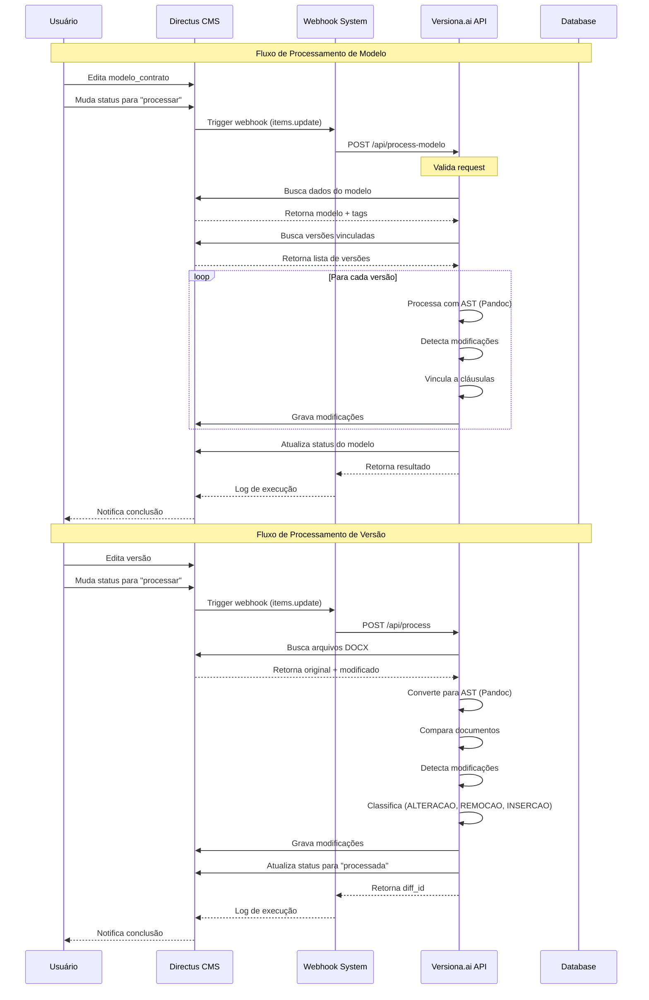
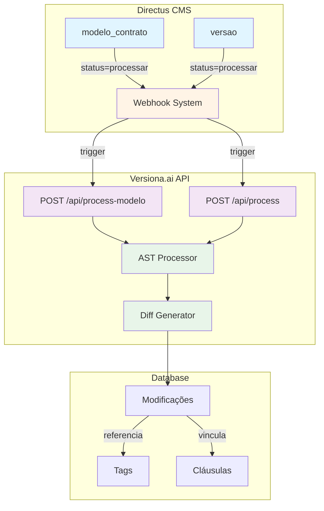
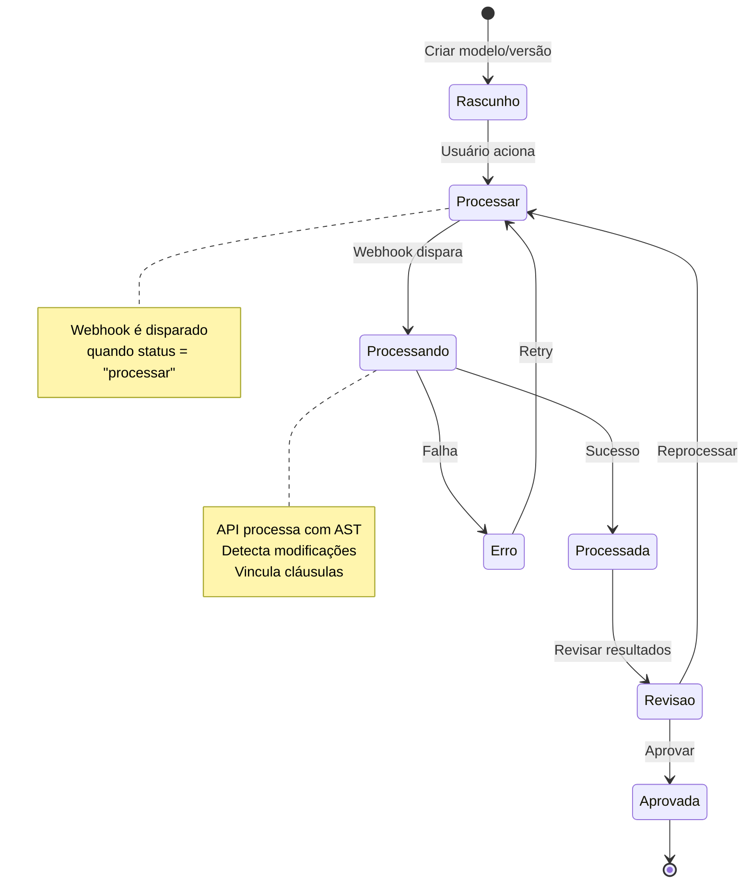

# Diagrama de Fluxo dos Webhooks

## Fluxo de Processamento via Webhook



## Arquitetura de Webhooks



## Estados e Transições



## Dados Trafegados

### Webhook de Modelo

```json
{
  "trigger": "items.update",
  "collection": "modelo_contrato",
  "key": "d2699a57-b0ff-472b-a130-626f5fc2852b",
  "payload": {
    "status": "processar"
  }
}
```

**Request para API:**

```json
{
  "modelo_id": "d2699a57-b0ff-472b-a130-626f5fc2852b",
  "use_ast": true,
  "process_tags": true,
  "process_versions": true,
  "dry_run": false
}
```

**Response da API:**

```json
{
  "status": "sucesso",
  "modelo_id": "d2699a57-b0ff-472b-a130-626f5fc2852b",
  "tags_encontradas": 11,
  "tags_criadas": 11,
  "versoes_processadas": 1,
  "total_modificacoes": 8
}
```

### Webhook de Versão

```json
{
  "trigger": "items.update",
  "collection": "versao",
  "key": "322e56c0-4b38-4e62-b563-8f29a131889c",
  "payload": {
    "status": "processar"
  }
}
```

**Request para API:**

```json
{
  "versao_id": "322e56c0-4b38-4e62-b563-8f29a131889c",
  "use_ast": true,
  "mock": false
}
```

**Response da API:**

```json
{
  "success": true,
  "diff_id": "e1133041-16dd-4893-a92c-8226319cebad",
  "url": "http://localhost:8000/view/e1133041-16dd-4893-a92c-8226319cebad",
  "modificacoes": [...],
  "metricas": {
    "total_modificacoes": 8,
    "alteracoes": 4,
    "remocoes": 2,
    "insercoes": 2
  },
  "metodo": "AST_PANDOC"
}
```
