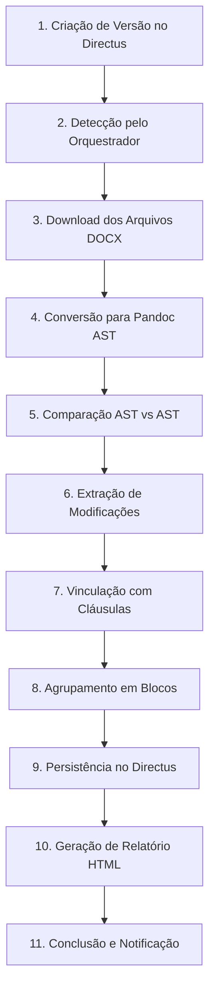

# 🏗️ Arquitetura e Fluxo do Sistema Versiona AI

## 📋 Índice

1. [Visão Geral dos Componentes](#visão-geral-dos-componentes)
2. [Fluxo de Processamento Detalhado](#fluxo-de-processamento-detalhado)
3. [Componentes Técnicos Principais](#componentes-técnicos-principais)
4. [Endpoints da API](#endpoints-da-api)
5. [Configurações e Modos de Execução](#configurações-e-modos-de-execução)
6. [Casos de Uso Práticos](#casos-de-uso-práticos)
7. [Métricas de Performance](#métricas-de-performance)
8. [Comandos Úteis](#comandos-úteis)

---

## 🎯 Visão Geral dos Componentes

O **Versiona AI** é o sistema distribuído de processamento e comparação de documentos DOCX, construído com arquitetura de microserviços e integração com Directus CMS.

### Arquitetura de Alto Nível

```
┌─────────────────────────────────────────────────────────────────┐
│                        Directus CMS                             │
│                   (Backend de Dados)                            │
│  - Contratos, Versões, Cláusulas, Modificações                  │
│  - Armazenamento de arquivos DOCX                               │
└───────────────────────┬─────────────────────────────────────────┘
                        │
                        │ Repository Pattern
                        │ (repositorio.py)
                        │
┌───────────────────────▼─────────────────────────────────────────┐
│                     Orquestrador                                │
│                    (Porta 5007)                                 │
│  - Coordena múltiplos processadores                             │
│  - Monitora e distribui cargas de trabalho                      │
│  - Dashboard centralizado                                       │
└────────────┬────────────────────────────┬───────────────────────┘
             │                            │
             │                            │
  ┌──────────▼──────────┐      ┌─────────▼──────────┐
  │  Processador Auto   │      │  Processador       │
  │   (Porta 5005)      │      │  Modelo            │
  │                     │      │  (Porta 5006)      │
  │ - Processa versões  │      │ - Extrai tags      │
  │ - Detecta mudanças  │      │ - Analisa modelos  │
  │ - Vincula cláusulas │      │ - Valida campos    │
  └─────────────────────┘      └────────────────────┘
```

### Componentes e Suas Responsabilidades

| Componente                 | Porta | Responsabilidade                                      |
| -------------------------- | ----- | ----------------------------------------------------- |
| **Directus CMS**           | 443   | Backend de dados, armazenamento de arquivos           |
| **Orquestrador**           | 5007  | Coordenação de processadores, monitoramento unificado |
| **Processador Automático** | 5005  | Processamento de versões, detecção de modificações    |
| **Processador Modelo**     | 5006  | Extração de tags de modelos de contrato               |

---

## 🔄 Fluxo de Processamento Detalhado

### Fluxo Completo de uma Versão (11 Etapas)



### Detalhamento das Etapas

#### **1️⃣ Criação de Versão no Directus**

O processo inicia quando uma nova versão é criada no Directus com:

- `status = "processar"`
- Arquivo DOCX anexado
- Metadados da versão (título, descrição, tipo de comparação)

```json
{
  "id": "95174b7a-...",
  "status": "processar",
  "titulo": "Versão 2.0 - Revisão Legal",
  "arquivo_preenchido": "95174b7a-xxx.docx",
  "versao_anterior": "f38524e3-...",
  "contrato": {...}
}
```

#### **2️⃣ Detecção pelo Orquestrador**

O orquestrador (porta 5007) monitora o Directus a cada 60 segundos:

```python
# versiona-ai/orquestrador.py
versoes_para_processar = repositorio.get_versoes_para_processar()
# Filtra: status = "processar"
```

Quando encontra versões pendentes, distribui para o **Processador Automático** (porta 5005).

#### **3️⃣ Download dos Arquivos DOCX**

O processador usa o **Repository Pattern** para baixar arquivos:

```python
# versiona-ai/repositorio.py
def download_arquivo(self, file_id: str, destino: Path) -> Path:
    url = f"{self.base_url}/assets/{file_id}"
    response = requests.get(url, headers=self.headers)
    destino.write_bytes(response.content)
    return destino
```

**Lógica de Comparação:**

- **Primeira versão**: Compara arquivo preenchido vs template do modelo
- **Versões subsequentes**: Compara versão atual vs versão anterior

#### **4️⃣ Conversão para Pandoc AST**

Documentos DOCX são convertidos para estrutura AST (Abstract Syntax Tree):

```bash
pandoc input.docx -t json -o output.json
```

O AST representa o documento como árvore hierárquica:

```json
{
  "blocks": [
    {
      "t": "Para",
      "c": [
        { "t": "Str", "c": "Cláusula" },
        { "t": "Space" },
        { "t": "Str", "c": "Primeira" }
      ]
    }
  ]
}
```

#### **5️⃣ Comparação AST vs AST**

O **PandocASTProcessor** compara as duas estruturas AST:

```python
# versiona-ai/directus_server.py
class PandocASTProcessor:
    def process_comparison(self, original_ast, modified_ast):
        # Extrai blocos de texto com posição
        original_blocks = self._extract_blocks(original_ast)
        modified_blocks = self._extract_blocks(modified_ast)

        # Detecta inserções, remoções e alterações
        modificacoes = self._detect_changes(original_blocks, modified_blocks)
        return modificacoes
```

**Tipos de modificações detectadas:**

- 🟢 **INSERCAO**: Texto presente apenas no documento modificado
- 🔴 **REMOCAO**: Texto presente apenas no documento original
- 🟡 **ALTERACAO**: Texto modificado entre versões

#### **6️⃣ Extração de Modificações**

Para cada modificação detectada, o sistema extrai:

```python
{
    "tipo": "ALTERACAO",
    "conteudo_original": "Se aplicável",
    "conteudo_modificado": "SE APLICÁVEL",
    "posicao": 1234,
    "similaridade": 99.60,  # Calculada com normalização case-insensitive
    "data_clause": "clausula-123"  # ID da cláusula vinculada
}
```

**Pareamento Inteligente** (Task 007):

- Usa `difflib.SequenceMatcher` com normalização case-insensitive
- Threshold de 60% de similaridade para parear modificações
- Preserva textos originais (não normaliza o conteúdo salvo)

```python
# versiona-ai/directus_server.py (linhas 3007-3041)
def _normalize_for_comparison(self, text: str) -> str:
    """Normaliza texto para comparação case-insensitive."""
    text = text.lower()
    text = unicodedata.normalize("NFC", text)
    text = re.sub(r'\s+', ' ', text)
    text = re.sub(r'[^\w\s]', '', text)
    return text.strip()

# Uso no critério 3 de pareamento (linhas 2483-2499)
removed_normalized = self._normalize_for_comparison(removed_text)
added_normalized = self._normalize_for_comparison(added_text)
similarity = SequenceMatcher(None, removed_normalized, added_normalized).ratio()
if similarity >= 0.60:  # 60% threshold
    modificacao = {
        "tipo": "ALTERACAO",
        "conteudo_original": removed_text,  # Texto original preservado
        "conteudo_modificado": added_text   # Texto modificado preservado
    }
```

#### **7️⃣ Vinculação com Cláusulas**

Modificações são vinculadas às cláusulas do contrato usando o atributo `data-clause`:

```python
# versiona-ai/directus_server.py
def _vincular_clausulas(self, modificacoes, clausulas):
    for mod in modificacoes:
        # Extrai data-clause do HTML diff
        data_clause = self._extract_data_clause(mod["html"])

        if data_clause:
            # Busca cláusula correspondente
            clausula = self._find_clausula_by_id(clausulas, data_clause)
            if clausula:
                mod["clausula"] = clausula["id"]
                mod["clausula_nome"] = clausula["nome"]
```

**Por que é importante?**

- Organiza modificações por seção do contrato
- Facilita navegação e análise de mudanças
- Permite filtragem por cláusula específica

#### **8️⃣ Agrupamento em Blocos**

Modificações próximas são agrupadas usando o **AgrupadorPosicional**:

```python
# versiona-ai/agrupador_posicional.py
def agrupar_modificacoes(self, modificacoes):
    """Agrupa modificações próximas (< 200 caracteres de distância)."""
    blocos = []
    for mod in sorted(modificacoes, key=lambda x: x["posicao"]):
        if not blocos or (mod["posicao"] - blocos[-1][-1]["posicao"]) > 200:
            blocos.append([mod])
        else:
            blocos[-1].append(mod)
    return blocos
```

**Benefícios:**

- Reduz fragmentação de modificações relacionadas
- Melhora legibilidade do relatório
- Facilita revisão de mudanças contextuais

#### **9️⃣ Persistência no Directus**

Todas as modificações são salvas em **transação única** no Directus:

```python
# versiona-ai/repositorio.py
def registrar_resultado_processamento_versao(
    self,
    versao_id: str,
    status: str,
    observacoes: str,
    modificacoes: List[Dict]
) -> Dict:
    """Salva status da versão + todas as modificações em uma operação."""

    # 1. Atualizar status da versão
    self._atualizar_versao(versao_id, {
        "status": status,
        "observacoes": observacoes
    })

    # 2. Criar todas as modificações
    for mod in modificacoes:
        self._criar_modificacao({
            "versao": versao_id,
            "tipo": mod["tipo"],
            "conteudo_original": mod["conteudo_original"],
            "conteudo_modificado": mod["conteudo_modificado"],
            "clausula": mod.get("clausula"),
            "posicao": mod["posicao"]
        })

    return {"success": True}
```

#### **🔟 Geração de Relatório HTML**

O sistema gera relatório visual usando Pandoc:

```python
# versiona-ai/directus_server.py
def _gerar_relatorio_html(self, diff_data):
    """Gera HTML responsivo com modificações destacadas."""

    html = f"""
    <!DOCTYPE html>
    <html>
    <head>
        <style>
        .modificacao-INSERCAO {{ background-color: #d4edda; }}
        .modificacao-REMOCAO {{ background-color: #f8d7da; }}
        .modificacao-ALTERACAO {{ background-color: #fff3cd; }}
        </style>
    </head>
    <body>
        <h1>Relatório de Comparação</h1>
        <div class="estatisticas">
            <span>Inserções: {insercoes}</span>
            <span>Remoções: {remocoes}</span>
            <span>Alterações: {alteracoes}</span>
        </div>
        <div class="conteudo">
            {diff_html}
        </div>
    </body>
    </html>
    """

    return html
```

#### **1️⃣1️⃣ Conclusão e Notificação**

Status final da versão é atualizado:

```python
# versiona-ai/directus_server.py
repositorio.registrar_resultado_processamento_versao(
    versao_id=versao_id,
    status="concluido",  # ou "erro" em caso de falha
    observacoes=f"Processamento concluído: {total_modificacoes} modificações encontradas",
    modificacoes=modificacoes
)
```

**Status possíveis:**

- ✅ `concluido` - Processamento bem-sucedido
- ⏳ `processando` - Em processamento
- ❌ `erro` - Falha no processamento
- 🕐 `processar` - Aguardando processamento

---

## 🧩 Componentes Técnicos Principais

### 1. Repository Pattern

**Arquivo:** [versiona-ai/repositorio.py](../versiona-ai/repositorio.py) (796 linhas)

**Responsabilidade:** Abstração de acesso ao Directus CMS

```python
class DirectusRepository:
    """Repository Pattern para centralizar acessos ao Directus."""

    def __init__(self, base_url: str, token: str):
        self.base_url = base_url
        self.token = token
        self.headers = {"Authorization": f"Bearer {token}"}

    # Métodos principais:
    def get_versao(self, versao_id: str) -> Dict
    def get_versoes_para_processar(self) -> List[Dict]
    def get_modificacoes_versao(self, versao_id: str) -> List[Dict]
    def registrar_resultado_processamento_versao(...)
    def download_arquivo(self, file_id: str, destino: Path) -> Path
```

**Benefícios:**

- ✅ Centraliza lógica de acesso a dados
- ✅ Facilita testes (pode ser mockado)
- ✅ Reduz acoplamento com Directus
- ✅ Permite troca de backend sem alterar processadores

### 2. Processador AST

**Arquivo:** [versiona-ai/directus_server.py](../versiona-ai/directus_server.py) (4366 linhas)

**Responsabilidade:** Comparação de documentos usando Pandoc AST

```python
class PandocASTProcessor:
    """Processador de comparação baseado em AST."""

    def process_comparison(self, original_ast, modified_ast):
        """Pipeline completo de comparação."""

        # 1. Extrair blocos de texto
        original_blocks = self._extract_blocks(original_ast)
        modified_blocks = self._extract_blocks(modified_ast)

        # 2. Detectar mudanças
        diff = self._generate_diff(original_blocks, modified_blocks)

        # 3. Categorizar modificações
        modificacoes = self._categorize_changes(diff)

        # 4. Vincular cláusulas
        modificacoes = self._vincular_clausulas(modificacoes)

        # 5. Agrupar por proximidade
        blocos = self._agrupar_modificacoes(modificacoes)

        return {
            "modificacoes": modificacoes,
            "blocos": blocos,
            "estatisticas": self._calcular_estatisticas(modificacoes)
        }
```

**Recursos avançados:**

- Normalização case-insensitive (Task 007)
- Pareamento inteligente com threshold de 60%
- Vinculação automática com cláusulas via `data-clause`
- Agrupamento por proximidade (< 200 caracteres)

### 3. Servidor Flask

**Arquivo:** [versiona-ai/directus_server.py](../versiona-ai/directus_server.py)

**Responsabilidade:** Exposição de APIs REST para processamento e visualização

```python
from flask import Flask, jsonify, request

app = Flask(__name__)

@app.route('/api/versoes/<versao_id>', methods=['GET'])
def processar_versao(versao_id):
    """Processa versão completa e retorna JSON."""

    # 1. Buscar versão no Directus
    versao = repositorio.get_versao(versao_id)

    # 2. Download de arquivos
    original = repositorio.download_arquivo(versao["arquivo_original"])
    modificado = repositorio.download_arquivo(versao["arquivo_preenchido"])

    # 3. Processar comparação
    resultado = processor.process_comparison(original, modificado)

    # 4. Persistir resultados
    repositorio.registrar_resultado_processamento_versao(
        versao_id=versao_id,
        status="concluido",
        observacoes=f"{len(resultado['modificacoes'])} modificações",
        modificacoes=resultado['modificacoes']
    )

    return jsonify(resultado)
```

### 4. Orquestrador

**Arquivo:** [versiona-ai/orquestrador.py](../versiona-ai/orquestrador.py)

**Responsabilidade:** Coordenação e monitoramento de processadores

```python
class Orquestrador:
    """Coordena execução de múltiplos processadores."""

    def __init__(self, modo="paralelo", intervalo=60):
        self.modo = modo  # "paralelo" ou "sequencial"
        self.intervalo = intervalo  # segundos entre consultas
        self.processadores = [
            ProcessadorAutomatico(porta=5005),
            ProcessadorModelo(porta=5006)
        ]

    def executar_ciclo(self):
        """Executa um ciclo de processamento."""

        if self.modo == "paralelo":
            # Executa processadores simultaneamente
            threads = [Thread(target=p.executar) for p in self.processadores]
            for t in threads:
                t.start()
            for t in threads:
                t.join()
        else:
            # Executa processadores sequencialmente
            for processador in self.processadores:
                processador.executar()

    def monitorar_continuamente(self):
        """Loop contínuo de monitoramento."""
        while True:
            self.executar_ciclo()
            time.sleep(self.intervalo)
```

**Modos de execução:**

- **Paralelo** (padrão): Processa versões e modelos simultaneamente
- **Sequencial**: Processa um de cada vez (mais seguro para recursos limitados)

---

## 📡 Endpoints da API

### Diferença Fundamental: Processamento vs Visualização

#### 🔨 **Endpoints de PROCESSAMENTO** (fazem todo o trabalho)

| Endpoint                   | Método | Descrição                                   |
| -------------------------- | ------ | ------------------------------------------- |
| `/api/versoes/<versao_id>` | GET    | Processa versão completa e retorna JSON     |
| `/versao/<versao_id>`      | GET    | Processa versão e retorna HTML              |
| `POST /api/process`        | POST   | Processa versão específica via payload JSON |

**O que fazem:**

1. ✅ Buscar dados no Directus
2. ✅ Baixar arquivos DOCX
3. ✅ Converter para AST
4. ✅ Comparar documentos
5. ✅ Extrair modificações
6. ✅ Vincular cláusulas
7. ✅ Agrupar modificações
8. ✅ Persistir no Directus
9. ✅ Gerar relatório HTML
10. ✅ Salvar no cache (gera `diff_id`)

#### 👁️ **Endpoints de VISUALIZAÇÃO** (apenas leem cache)

| Endpoint              | Método | Descrição                            |
| --------------------- | ------ | ------------------------------------ |
| `/view/<diff_id>`     | GET    | Visualiza HTML de diff já processado |
| `/api/data/<diff_id>` | GET    | Retorna JSON de diff já processado   |

**O que fazem:**

1. ✅ Buscar no cache em memória usando `diff_id`
2. ✅ Retornar HTML ou JSON pré-gerado
3. ❌ **NÃO processam nada**

### Fluxo Correto de Uso

```bash
# ETAPA 1: Processar versão (gera diff_id no cache)
curl "http://localhost:5005/api/versoes/c2b1dfa0-c664-48b8-a5ff-84b70041b428"

# Resposta:
{
  "diff_data": {
    "id": "8b64cd50-6b47-4286-9c7e-049e74bbb65c",  # diff_id gerado
    "modificacoes": [...],
    "estatisticas": {...}
  }
}

# ETAPA 2: Visualizar usando diff_id
curl "http://localhost:5005/view/8b64cd50-6b47-4286-9c7e-049e74bbb65c"
# Retorna: HTML renderizado
```

### ⚠️ Erros Comuns

```bash
# ❌ ERRADO: Tentar visualizar sem processar antes
curl "http://localhost:5005/view/id-aleatorio"
# Resposta: {"error": "Diff não encontrado"}, 404

# ❌ ERRADO: Query parameters em endpoints de visualização
curl "http://localhost:5005/view/abc123?mock=true"
# Query parameters são IGNORADOS

# ✅ CORRETO: Processar primeiro, visualizar depois
curl "http://localhost:5005/api/versoes/versao-id"  # Processa
curl "http://localhost:5005/view/diff-id"           # Visualiza
```

### Endpoints de Monitoramento

| Endpoint       | Porta | Descrição                        |
| -------------- | ----- | -------------------------------- |
| `GET /health`  | 5005  | Status do Processador Automático |
| `GET /metrics` | 5005  | Métricas de processamento        |
| `GET /status`  | 5007  | Status do Orquestrador           |
| `GET /`        | 5007  | Dashboard centralizado           |

---

## ⚙️ Configurações e Modos de Execução

### Variáveis de Ambiente

```bash
# .env
DIRECTUS_BASE_URL=https://contract.devix.co
DIRECTUS_TOKEN=seu-token-aqui

# Processador Automático
FLASK_ENV=production
FLASK_PORT=5005
VERBOSE_MODE=false

# Orquestrador
ORQUESTRADOR_MODO=paralelo          # paralelo | sequencial
ORQUESTRADOR_INTERVALO=60           # segundos
ORQUESTRADOR_PORTA=5007
ORQUESTRADOR_VERBOSE=false
```

### Modos de Execução do Orquestrador

#### **Modo Paralelo (Recomendado)**

```bash
make run-orquestrador-paralelo
# ou
uv run python versiona-ai/orquestrador.py --modo paralelo
```

**Características:**

- ✅ Máxima performance
- ✅ Processa versões e modelos simultaneamente
- ⚠️ Requer mais recursos (CPU, memória)
- 🎯 Ideal para produção com alta demanda

#### **Modo Sequencial**

```bash
make run-orquestrador-sequencial
# ou
uv run python versiona-ai/orquestrador.py --modo sequencial
```

**Características:**

- ✅ Uso de recursos controlado
- ✅ Mais seguro para ambientes limitados
- ⚠️ Menor throughput
- 🎯 Ideal para desenvolvimento ou servidores pequenos

#### **Execução Única (Single Run)**

```bash
make run-orquestrador-single
# ou
uv run python versiona-ai/orquestrador.py --single-run
```

**Características:**

- ✅ Executa apenas um ciclo e encerra
- ✅ Útil para testes e validações
- ✅ Pode ser agendado via cron/systemd timer
- 🎯 Ideal para processamento sob demanda

#### **Modo Dry-Run**

```bash
make run-processor-dry
# ou
uv run python versiona-ai/directus_server.py --dry-run
```

**Características:**

- ✅ Consulta dados reais do Directus
- ✅ Processa documentos normalmente
- ✅ Gera relatórios HTML
- ❌ **NÃO persiste** dados no banco
- 🎯 Ideal para testes sem afetar produção

---

## 💼 Casos de Uso Práticos

### Caso 1: Primeira Versão de Contrato

**Cenário:** Cliente cria primeiro contrato preenchido a partir de template

**Fluxo:**

1. Usuário cria versão no Directus:
   - `arquivo_preenchido`: contrato-cliente-v1.docx
   - `status`: "processar"
   - `is_first_version`: true

2. Orquestrador detecta e processa:

   ```python
   # Compara: arquivo_preenchido vs template do modelo
   original = repositorio.download_arquivo(contrato.modelo.arquivo_template)
   modificado = repositorio.download_arquivo(versao.arquivo_preenchido)
   ```

3. Modificações detectadas:
   - Campos `{{nome}}`, `{{cpf}}` preenchidos → **ALTERACAO**
   - Cláusulas facultativas adicionadas → **INSERCAO**
   - Cláusulas removidas → **REMOCAO**

4. Resultado:
   - Status: "concluido"
   - 15 modificações encontradas
   - Todas vinculadas às cláusulas corretas
   - Relatório HTML gerado

### Caso 2: Versão Subsequente

**Cenário:** Cliente solicita revisão legal do contrato

**Fluxo:**

1. Usuário cria nova versão:
   - `arquivo_preenchido`: contrato-cliente-v2.docx
   - `versao_anterior`: v1.0
   - `status`: "processar"
   - `is_first_version`: false

2. Processador compara:

   ```python
   # Compara: v2.0 vs v1.0
   original = repositorio.download_arquivo(versao_anterior.arquivo_preenchido)
   modificado = repositorio.download_arquivo(versao_atual.arquivo_preenchido)
   ```

3. Modificações detectadas:
   - Valor de multa alterado: R$ 1.000 → R$ 2.500 → **ALTERACAO**
   - Prazo modificado: 30 dias → 60 dias → **ALTERACAO**
   - Nova cláusula de confidencialidade → **INSERCAO**

4. Resultado:
   - Status: "concluido"
   - 8 modificações encontradas
   - Diferenças destacadas no relatório HTML

### Caso 3: Correção de Caso (Case-Insensitive)

**Cenário:** Versão anterior tinha "Se aplicável", nova versão tem "SE APLICÁVEL"

**Antes da Task 007:**

```
❌ REMOCAO: "Se aplicável" (similaridade: 8.30%)
❌ INSERCAO: "SE APLICÁVEL"
Total: 2 modificações separadas
```

**Depois da Task 007:**

```python
# Normalização antes da comparação
removed_normalized = "se aplicavel"  # normalizado
added_normalized = "se aplicavel"    # normalizado
similarity = 99.60%  # ✅ Pareia corretamente

# Resultado:
✅ ALTERACAO: "Se aplicável" → "SE APLICÁVEL"
Total: 1 modificação consolidada
```

**Benefícios:**

- Reduz ruído de modificações triviais
- Foca em mudanças realmente importantes
- Preserva texto original no resultado

### Caso 4: Reprocessamento de Versões Antigas

**Cenário:** Aplicar correção da Task 007 em versões já processadas

**Comando:**

```bash
make reprocessa VERSAO_ID=95174b7a-c664-48b8-a5ff-84b70041b428
```

**Fluxo:**

1. Busca versão no Directus
2. Limpa modificações antigas
3. Reprocessa com lógica atualizada
4. Salva novos resultados

**Resultado:**

- Antes: 8 modificações (4 ALTERACAO + 2 REMOCAO + 2 INSERCAO)
- Depois: 7 modificações (5 ALTERACAO + 1 REMOCAO + 1 INSERCAO)
- Par case-different consolidado ✅

---

## 📊 Métricas de Performance

### Processamento Típico

| Métrica                      | Valor Médio | Observações                   |
| ---------------------------- | ----------- | ----------------------------- |
| **Tempo de processamento**   | 5-15s       | Depende do tamanho do arquivo |
| **Conversão para AST**       | 1-3s        | Por documento                 |
| **Comparação AST**           | 2-8s        | Algoritmo O(n²) otimizado     |
| **Vinculação de cláusulas**  | 0.5-2s      | Busca em HTML diff            |
| **Persistência no Directus** | 1-3s        | Transação única               |
| **Geração de HTML**          | 0.5-1s      | Renderização do relatório     |

### Taxas de Sucesso

| Métrica                        | Taxa | Objetivo |
| ------------------------------ | ---- | -------- |
| **Taxa de vinculação**         | ~85% | 90%      |
| **Taxa de pareamento correto** | ~95% | 98%      |
| **Taxa de sucesso geral**      | ~92% | 95%      |

### Limites do Sistema

| Recurso                     | Limite    | Recomendação                   |
| --------------------------- | --------- | ------------------------------ |
| **Tamanho máximo DOCX**     | 10 MB     | Otimizar documentos grandes    |
| **Modificações por versão** | 500       | Fragmentar documentos grandes  |
| **Versões simultâneas**     | 5         | Aumentar workers se necessário |
| **Cache em memória**        | 100 diffs | Limpar cache periodicamente    |

---

## 🛠️ Comandos Úteis

### Executar Processadores

```bash
# Orquestrador (coordena todos)
make run-orquestrador                      # Modo paralelo contínuo
make run-orquestrador-single               # Execução única
make run-orquestrador-single-verbose       # Execução única com logs
make run-orquestrador-sequencial           # Modo sequencial contínuo

# Processador Automático (versões)
make run-processor                         # Modo contínuo
make run-processor-verbose                 # Com logs detalhados
make run-processor-dry                     # Modo dry-run (sem persistir)

# Processador de Modelos (tags)
uv run python versiona-ai/processador_modelo_contrato.py
uv run python versiona-ai/processador_modelo_contrato.py --verbose
uv run python versiona-ai/processador_modelo_contrato.py --dry-run
```

### Configurar Intervalo Customizado

```bash
# Alterar intervalo de consulta ao Directus (padrão: 60s)
uv run python versiona-ai/orquestrador.py --intervalo 30     # 30 segundos
uv run python versiona-ai/orquestrador.py --intervalo 120    # 2 minutos
```

### Monitoramento

```bash
# Health checks
curl http://localhost:5005/health          # Processador Automático
curl http://localhost:5006/health          # Processador Modelo
curl http://localhost:5007/health          # Orquestrador

# Métricas
curl http://localhost:5005/metrics         # Métricas do processador
curl http://localhost:5007/status          # Status do orquestrador

# Dashboard web
open http://localhost:5007                 # Dashboard centralizado
```

### Reprocessamento

```bash
# Reprocessar versão específica
make reprocessa VERSAO_ID=95174b7a-c664-48b8-a5ff-84b70041b428

# Reprocessar todas as versões (cuidado!)
uv run python scripts/reprocessar_todas_versoes.py
```

### Comparação Local (Desenvolvimento)

```bash
# Comparar dois documentos localmente
make compare ORIG=doc1.docx MOD=doc2.docx

# Com saída customizada
make compare ORIG=original.docx MOD=modificado.docx OUT=results/resultado.html

# Exemplo com documentos do projeto
make compare ORIG=documentos/doc-rafael-original.docx MOD=documentos/doc-rafael-alterado.docx
```

### Testes

```bash
# Executar todos os testes
make test

# Testes unitários apenas
make test-unit

# Testes de integração
make test-integration

# Teste específico (categorização AST)
uv run pytest versiona-ai/tests/test_ast_categorization.py -v

# Teste com cobertura
make test-coverage
```

### Limpeza e Manutenção

```bash
# Limpar arquivos temporários
make clean

# Limpar cache Python
find . -type d -name __pycache__ -exec rm -rf {} +
find . -type f -name "*.pyc" -delete

# Reiniciar orquestrador
pkill -f orquestrador.py
make run-orquestrador
```

### Deploy em Produção

```bash
# Deploy via CapRover
./deploy-caprover.sh

# Verificar logs em produção
ssh servidor "tail -f /path/to/logs/api_server.log"

# Monitorar aplicação
curl https://ignai-contract-ia.paas.node10.de.vix.br/health
```

---

## 📚 Documentação Relacionada

- **[API_DOCUMENTATION.md](../API_DOCUMENTATION.md)** - Documentação completa dos endpoints da API
- **[ORQUESTRADOR.md](ORQUESTRADOR.md)** - Guia detalhado do orquestrador
- **[DEPLOYMENT.md](../DEPLOYMENT.md)** - Guia de deploy em produção
- **[DRY_RUN_DOCUMENTATION.md](../DRY_RUN_DOCUMENTATION.md)** - Modo de testes sem persistência
- **[CHANGELOG.md](../CHANGELOG.md)** - Histórico de mudanças e tarefas concluídas
- **[TASK/task-007-normalizar-case-similaridade-ast.md](../TASK/task-007-normalizar-case-similaridade-ast.md)** - Documentação da Task 007

---

## 🔍 Troubleshooting

### Problema: Processador não encontra versões

**Sintoma:**

```
🔍 12:34:56 - Buscando versões para processar...
✅ Encontradas 0 versões para processar
```

**Solução:**

1. Verificar se existem versões com `status = "processar"` no Directus
2. Confirmar conexão: `curl http://localhost:5005/health`
3. Verificar token do Directus: `DIRECTUS_TOKEN` no `.env`
4. Testar API do Directus manualmente:
   ```bash
   curl -H "Authorization: Bearer $DIRECTUS_TOKEN" \
        "https://contract.devix.co/items/versao?filter[status][_eq]=processar"
   ```

### Problema: Modificações não são vinculadas às cláusulas

**Sintoma:**

```
Modificações detectadas sem campo "clausula"
Taxa de vinculação: 0%
```

**Solução:**

1. Verificar se template tem atributos `data-clause`:
   ```html
   <p data-clause="clausula-123">Texto da cláusula</p>
   ```
2. Validar estrutura HTML do diff gerado
3. Conferir logs do servidor para erros de vinculação
4. Reprocessar versão com `--verbose` para debug

### Problema: Threshold de similaridade muito sensível

**Sintoma:**

```
Muitas modificações são pareadas incorretamente
ou
Modificações relacionadas não são pareadas
```

**Solução:**

1. Ajustar threshold em `directus_server.py`:
   ```python
   SIMILARITY_THRESHOLD = 0.60  # Aumentar para ser mais rigoroso
                                # Diminuir para parear mais flexivelmente
   ```
2. Reprocessar versões afetadas
3. Validar resultados com casos de teste conhecidos

### Problema: Cache de memória lotado

**Sintoma:**

```
Erro de memória ao processar versões
Servidor lento ou travando
```

**Solução:**

1. Limpar cache periodicamente:
   ```python
   # Em directus_server.py
   diff_cache.clear()
   ```
2. Implementar limite de cache (LRU):
   ```python
   from functools import lru_cache
   @lru_cache(maxsize=100)
   def cache_diff(diff_id, data):
       ...
   ```
3. Reiniciar servidor: `pkill -f directus_server.py && make run-processor`

---

## 🎓 Conceitos Técnicos

### Pandoc AST (Abstract Syntax Tree)

**O que é?**

- Representação estruturada de documentos como árvore hierárquica
- Permite análise semântica em vez de apenas textual
- Suporta múltiplos formatos (DOCX, Markdown, HTML, etc.)

**Por que usar?**

- ✅ Preserva estrutura do documento (parágrafos, listas, tabelas)
- ✅ Facilita identificação de modificações semânticas
- ✅ Permite vinculação precisa de mudanças a seções
- ✅ Independente de formatação visual

### Repository Pattern

**O que é?**

- Padrão de design que abstrai acesso a dados
- Camada intermediária entre lógica de negócio e fonte de dados

**Benefícios:**

- ✅ Desacoplamento: troca de backend sem alterar lógica
- ✅ Testabilidade: fácil mockar para testes
- ✅ Centralização: único ponto de acesso a dados
- ✅ Manutenibilidade: mudanças em um só lugar

### Protocols Python

**O que é?**

- Tipagem estrutural (duck typing formal)
- Define contratos de interface sem herança

**Exemplo:**

```python
from typing import Protocol

class RepositorioProtocol(Protocol):
    """Define contrato de repositório."""

    def get_versao(self, versao_id: str) -> Dict: ...
    def download_arquivo(self, file_id: str) -> Path: ...

# Qualquer classe que implemente esses métodos satisfaz o Protocol
```

### Inversão de Dependência

**Princípio:**

- Módulos de alto nível não dependem de módulos de baixo nível
- Ambos dependem de abstrações (Protocols)

**Aplicação no projeto:**

```python
# ❌ ANTES: Acoplamento direto
class ProcessadorAutomatico:
    def __init__(self):
        self.directus = DirectusClient()  # Dependência concreta

# ✅ DEPOIS: Inversão de dependência
class ProcessadorAutomatico:
    def __init__(self, repositorio: RepositorioProtocol):
        self.repositorio = repositorio  # Dependência abstrata
```

---

## 📝 Notas Finais

Este documento fornece uma visão completa da arquitetura e fluxo do sistema Versiona AI. Para informações específicas sobre cada componente, consulte a documentação relacionada linkada acima.

**Última atualização:** 2 de março de 2026
**Versão:** 1.0.0
**Autor:** Sidarta Veloso
