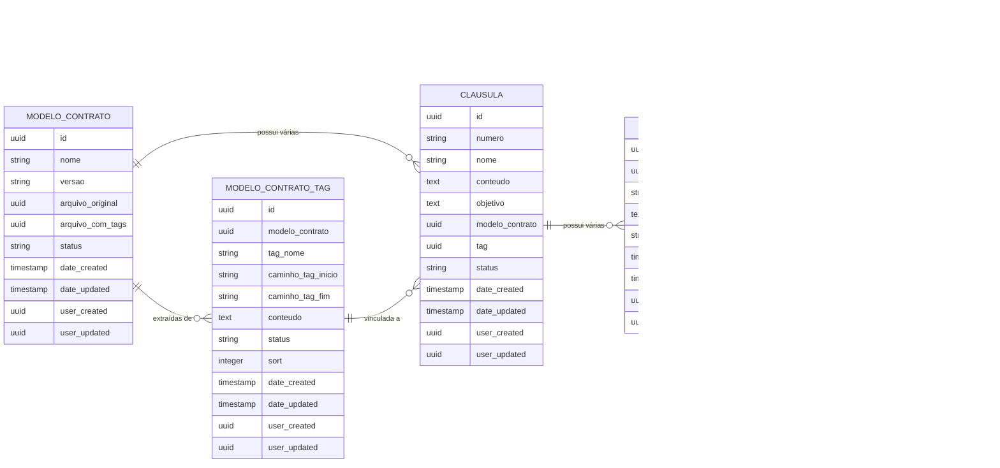

# **Implementação de Cláusulas e Referencias no versiona.ai**

# **1\. Objetivo**

O objetivo é fazer com que o sistema associe **cláusulas** a cada alteração
detectada em uma versão de contrato**, orientando o usuário sobre quais ações ou respostas são necessárias diante dessas alteração. 

As cláusulas são cadastrads manualmente no sistema e associadas a partir de **tags únicas** inseridas no _Template modelo com tags_. Cada tag delimita um
bloco de texto, transformando-o em uma **cláusula identificável**.

A sintaxe para taggear parte do documento .docx é:

**{{TAG-**_nome_unico_**}}**

conteúdo

**{{/TAG-**_nome_unico_**}}**

exemplo:
<pre>
{{TAG-responsavel}}

Nome: Sidarta
E-mail: sidartaveloso@gmail.com

{{/TAG-responsavel}}
</pre>

Desta forma, o contrato deixa de ser apenas um texto contínuo e passa a ser
organizado em **unidades menores (cláusulas com referências)**.

Referencias são ações, regras de validação ou notificações que devem ser apresentadas ao usuário sempre que a cláusula correspondente for modificada através da versão.

Assim, o sistema garante rastreabilidade das mudanças, contextualiza seu impacto e fornece instruções claras ao usuário durante a análise de versões de contratos.

---

## **2\. Estrutura de Dados**

---

## **3\. Fluxo de Funcionamento**

1. **Cadastro do Modelo de Contrato:**
   - Usuário cadastra/atualiza um **Modelo de Contrato** no Directus
   - Campo **arquivo_original** contém o modelo sem tags
   - Campo **arquivo_com_tags** contém modelo com tags delimitando blocos

2. **Processamento das Tags:**
   - Sistema processa o **arquivo_com_tags** identificando blocos `{{TAG-nome_unico}}`
   - Para cada tag encontrada, cria registro na tabela **modelo_contrato_tag**
   - Associa o conteúdo delimitado pela tag ao registro

3. **Cadastro de Cláusulas:**
   - Para cada tag processada, usuário pode criar **Cláusulas** associadas
   - Campo **tag** da cláusula referencia a tag do modelo
   - Campo **numero** identifica a cláusula (ex: "1.1", "2.3")
   - Campo **conteudo** contém o texto da cláusula
   - Campo **objetivo** descreve o propósito da cláusula

4. **Cadastro de Referências:**
   - Para cada cláusula, usuário pode cadastrar várias **Referências**
   - Campo **orientacao_retorno** define o tipo de ação
   - Campo **descricao** contém instruções detalhadas

5. **Processamento de Versões:**
   - Quando ocorre uma nova versão de contrato:
     - Sistema compara os blocos taggeados entre versões
     - Identifica diferenças no conteúdo das cláusulas
     - Cria registros de **modificacao** para alterações detectadas
     - Vincula modificações às referências através de **modificacao_referencia**
     - Exibe as referências associadas às cláusulas alteradas

---

## **4\. Implementação no Schema Atual**

### **4.1. Tabelas Principais**

- **modelo_contrato**: Já implementada com campos corretos
  - `arquivo_original`: Template sem tags
  - `arquivo_com_tags`: Template com tags delimitadoras
  - Status workflow: draft → processar → em_processamento → concluido → publicado

- **clausula**: ✅ **Já implementada completamente**
  - Relacionamento com `modelo_contrato` (Many-to-One) ✅
  - Campo `numero` para identificação (ex: "1.1", "2.3") ✅
  - Campos `conteudo` e `objetivo` já implementados ✅
  - **Campo `tag` já implementado** ✅ referenciando `modelo_contrato_tag`

- **referencia**: Já implementada corretamente
  - Relacionamento com `clausula` (Many-to-One)
  - Campos `orientacao_retorno` e `descricao` implementados

### **4.2. Tabelas de Relacionamento**

- **modelo_contrato_tag**: ✅ **Implementação muito avançada**
  - Armazena tags extraídas do template ✅
  - **Campos especiais para processamento avançado:**
    - `tag_nome`: Nome da tag (ex: "responsavel", "cabecalho")
    - `caminho_tag_inicio`: Posição estrutural da tag de início no documento
    - `caminho_tag_fim`: Posição estrutural da tag de fim no documento
    - `conteudo`: Conteúdo extraído entre as tags
  - Suporte completo a comparações estruturais de documentos ✅

- **modificacao_referencia**: Recém adicionada
  - Liga modificações às referências relevantes
  - Permite rastreamento de quais orientações aplicar

### **4.3. Status da Implementação**

✅ **COMPLETAMENTE IMPLEMENTADO:**
- Todas as tabelas principais estão criadas
- Relacionamentos entre tabelas funcionais
- Campo `tag` em `clausula` já vinculado a `modelo_contrato_tag`
- Estrutura de dados suporta completamente os requisitos

🔄 **PENDENTE - IMPLEMENTAÇÃO LÓGICA:**
1. **Processador de tags automático**:
   - Parser para extrair `{{TAG-nome}}...{{/TAG-nome}}` do arquivo_com_tags
   - Popula automaticamente os campos `tag_nome`, `caminho_tag_inicio`, `caminho_tag_fim`, `conteudo`
   - Workflow automatizado quando `modelo_contrato.status = "processar"`

2. **Comparador de versões com tags**:
   - Utiliza campos `caminho_tag_inicio` e `caminho_tag_fim` para comparação precisa
   - Compara `conteudo` de tags entre template e versão atual do contrato
   - Detecta mudanças em blocos específicos delimitados por tags
   - Cria vínculos `modificacao_referencia` automaticamente para mudanças detectadas

3. **Interface para exibição**:
   - Mostrar cláusulas modificadas com suas referências correspondentes
   - Destacar diferenças em blocos taggeados usando comparação estrutural
   - Apresentar `orientacao_retorno` e `descricao` das referências associadas
   - Permitir ações do analista baseadas nas orientações recebidas

---