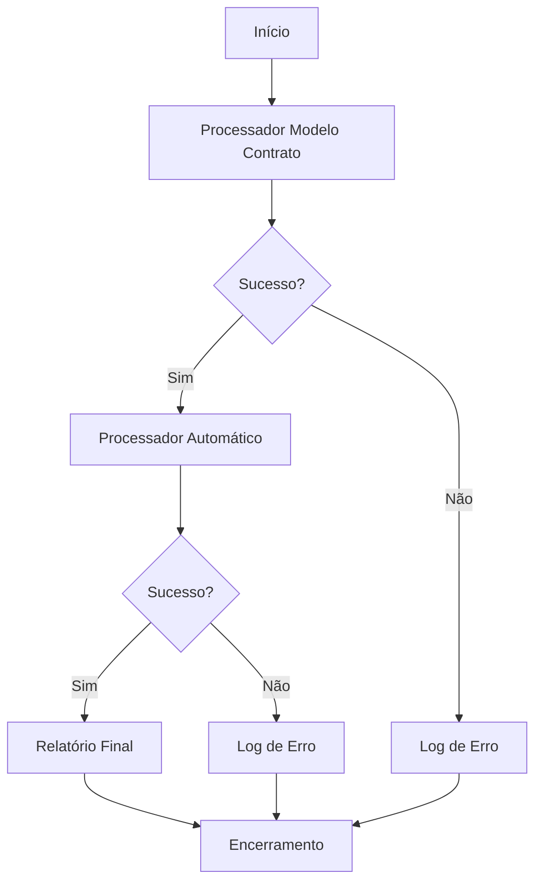
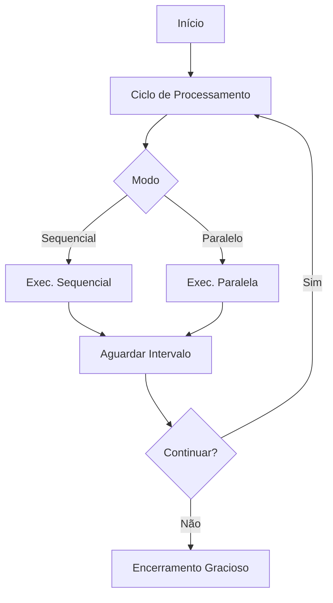

# 🎯 Orquestrador de Processadores

## 📋 Visão Geral

O Orquestrador é um componente central que coordena a execução de múltiplos processadores do sistema docx-compare. Ele permite executar os processadores de forma:

- **Sequencial**: Um após o outro (primeiro modelo de contrato, depois automático)
- **Paralela**: Ambos simultaneamente
- **Single-run**: Execução única e encerramento automático
- **Contínua**: Execução em loop com intervalos configuráveis

## 🚀 Execução Rápida

### Comandos Make (Recomendados)

```bash
# Execução única sequencial (mais comum)
make run-orquestrador-single

# Execução única com logs detalhados
make run-orquestrador-single-verbose

# Execução contínua em modo sequencial
make run-orquestrador-sequencial

# Execução contínua em modo paralelo
make run-orquestrador-paralelo
```

### Comando Direto

```bash
# Execução única sequencial (recomendado)
uv run python src/docx_compare/processors/orquestrador.py --single-run --modo sequencial --verbose

# Execução contínua paralela (padrão)
uv run python src/docx_compare/processors/orquestrador.py

# Execução contínua sequencial
uv run python src/docx_compare/processors/orquestrador.py --modo sequencial

# Configurações personalizadas
uv run python src/docx_compare/processors/orquestrador.py \
  --modo sequencial \
  --single-run \
  --verbose \
  --intervalo 30 \
  --porta 5008
```

## ⚙️ Parâmetros de Configuração

| Parâmetro      | Padrão     | Descrição                                    |
| -------------- | ---------- | -------------------------------------------- |
| `--modo`       | `paralelo` | Modo de execução: `sequencial` ou `paralelo` |
| `--single-run` | `false`    | Executa apenas um ciclo e encerra            |
| `--verbose`    | `false`    | Logs detalhados de execução                  |
| `--intervalo`  | `60`       | Intervalo entre ciclos (segundos)            |
| `--porta`      | `5007`     | Porta do servidor de monitoramento           |

## 🔄 Modos de Execução

### Modo Sequencial

Executa os processadores um após o outro:

1. 🏷️ **Processador de Modelo de Contrato** (extração de tags)
2. 🔄 **Processador Automático** (processamento de versões)

**Vantagens:**

- Uso controlado de recursos
- Logs organizados
- Ideal para ambientes com recursos limitados

**Quando usar:**

- Execução única (single-run)
- Ambientes de produção
- Debugging

### Modo Paralelo

Executa ambos os processadores simultaneamente.

**Vantagens:**

- Máximo throughput
- Processamento independente
- Ideal para ambientes com recursos abundantes

**Quando usar:**

- Execução contínua
- Ambientes de desenvolvimento
- Alto volume de processamento

## 📊 Monitoramento

### Endpoints Disponíveis

O orquestrador expõe uma API REST para monitoramento:

```
http://localhost:5007/
├── /               # Dashboard principal
├── /health         # Health check
├── /status         # Status detalhado dos processadores
└── /metrics        # Métricas do sistema
```

### Dashboard Web

Acesse http://localhost:5007 para ver:

- ✅ Status dos processadores
- 📊 Estatísticas de execução
- ⏱️ Tempo de última execução
- 🔄 Modo de execução atual
- 📈 Métricas de performance

### API JSON

```bash
# Status geral
curl http://localhost:5007/health

# Status detalhado
curl http://localhost:5007/status

# Métricas completas
curl http://localhost:5007/metrics
```

## 🏃‍♂️ Fluxo de Execução

### Single-Run Sequencial (Recomendado)



### Execução Contínua



## 🔧 Integração com Processadores

### Processador de Modelo de Contrato

- **Responsabilidade**: Extrair tags de modelos de contrato
- **Input**: Registros com status `processar` na coleção `modelo_contrato`
- **Output**: Tags extraídas salvas na coleção `modelo_contrato_tag`
- **Porta**: 5006

### Processador Automático

- **Responsabilidade**: Processar versões de documentos
- **Input**: Registros com status `processar` na coleção `versao`
- **Output**: Relatórios de comparação e modificações
- **Porta**: 5005

## 🚨 Tratamento de Erros

### Timeouts

- Cada processador tem timeout de 5 minutos
- Execução é cancelada automaticamente em caso de travamento

### Falhas de Processador

- Falha em um processador não afeta o outro
- Logs detalhados para debugging
- Status individual de cada processador

### Signal Handling

- **SIGINT/SIGTERM**: Encerramento gracioso
- **SIGHUP**: Reload de configuração
- Finalização segura de todos os subprocessos

## 📋 Logs e Debugging

### Modo Verbose

```bash
# Ativar logs detalhados
make run-orquestrador-single-verbose
```

**Informações incluídas:**

- Stdout/stderr de cada processador
- Timestamps detalhados
- Status de cada etapa
- Métricas de performance

### Estrutura de Logs

```
🎯 Orquestrador de Processadores
📊 Modo de execução: sequencial
🎯 Modo single-run: executando apenas um ciclo

🚀 Iniciando ciclo de processamento - 18:04:06
🏷️ Executando processador de modelo de contrato...
✅ Processador de modelo de contrato executado com sucesso
🔄 Executando processador automático...
✅ Processador automático executado com sucesso

📊 Resultados sequenciais:
   🏷️  Processador modelo: ✅
   🔄 Processador automático: ✅
⏱️  Ciclo completado em 4.49 segundos
✅ Ciclo único completado
```

## 🔄 Casos de Uso Comuns

### 1. Execução Manual Única

```bash
# Para processar tudo que está pendente uma vez
make run-orquestrador-single
```

### 2. Monitoramento Contínuo

```bash
# Para deixar rodando continuamente
make run-orquestrador-sequencial
```

### 3. Debugging de Problemas

```bash
# Para investigar problemas com logs detalhados
make run-orquestrador-single-verbose
```

### 4. Ambiente de Desenvolvimento

```bash
# Para desenvolvimento com máximo throughput
make run-orquestrador-paralelo
```

### 5. Configuração Customizada

```bash
# Para configurações específicas
uv run python src/docx_compare/processors/orquestrador.py \
  --modo sequencial \
  --intervalo 30 \
  --porta 5008 \
  --verbose
```

## 📈 Performance e Recursos

### Consumo de Recursos

**Modo Sequencial:**

- CPU: Médio (um processo por vez)
- Memória: Baixo-Médio
- I/O: Controlado

**Modo Paralelo:**

- CPU: Alto (dois processos simultâneos)
- Memória: Médio-Alto
- I/O: Intensivo

### Recomendações

**Produção:**

- Use modo sequencial para estabilidade
- Configure intervalo de 60-120 segundos
- Use single-run para execuções pontuais

**Desenvolvimento:**

- Use modo paralelo para velocidade
- Intervalo de 30-60 segundos
- Use verbose para debugging

## 🔐 Segurança

### Isolamento de Processos

- Cada processador executa em subprocess isolado
- Timeouts previnem travamentos
- Falhas não propagam entre processadores

### Monitoramento Seguro

- Endpoints HTTP apenas para leitura
- Sem exposição de dados sensíveis
- Logs não incluem tokens/senhas

## 🚀 Próximos Passos

1. **Scheduling**: Integração com cron para execução programada
2. **Alertas**: Notificações em caso de falhas
3. **Métricas Avançadas**: Integração com Prometheus/Grafana
4. **Load Balancing**: Distribuição entre múltiplas instâncias
5. **Auto-scaling**: Ajuste automático baseado na carga
